# TODO List アプリケーション仕様書

## 1. 概要

### 1.1 アプリケーション名
TODO List

### 1.2 目的
ユーザーがタスクを効率的に管理できるシンプルで使いやすいTODOリストアプリケーション

### 1.3 技術スタック

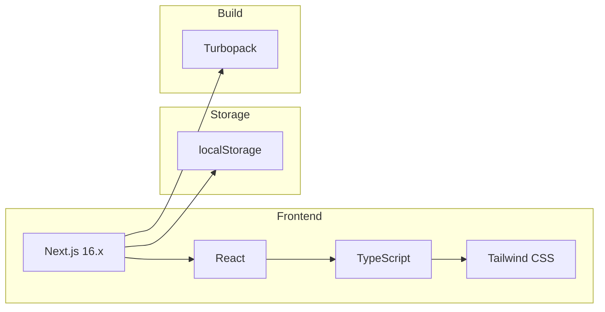

| 項目 | 技術 |
|------|------|
| フレームワーク | Next.js 16.x (App Router) |
| 言語 | TypeScript |
| スタイリング | Tailwind CSS |
| データ永続化 | localStorage |
| ビルドツール | Turbopack |

---

## 2. 機能一覧

### 2.1 機能概要図

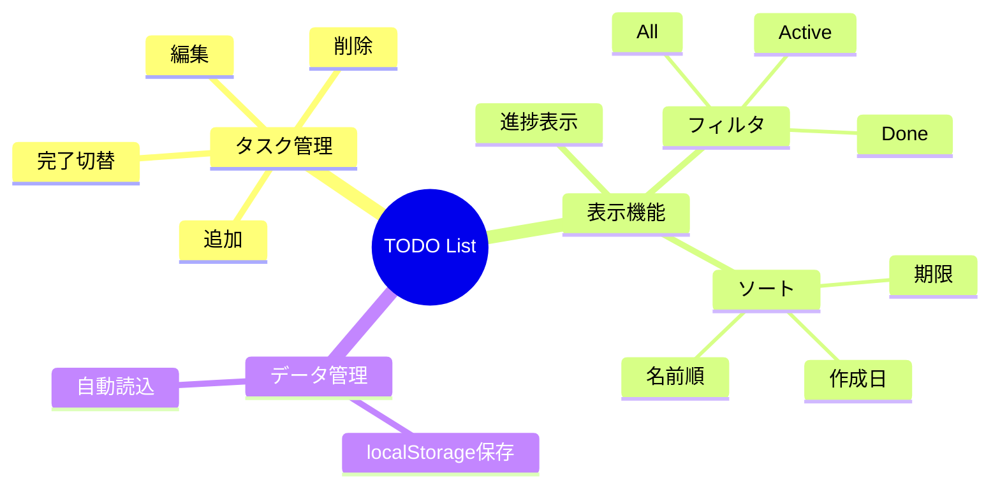

### 2.2 タスク管理機能

#### 2.2.1 タスクの追加
- タスク名（必須）と期限（必須）を入力して新しいタスクを作成
- Enterキーまたは「Add」ボタンで追加
- 追加時に登録日時と更新日時が自動記録される

#### 2.2.2 タスクの編集
- 既存タスクのタスク名と期限を編集可能
- 編集モードではEnterキーで保存、Escapeキーでキャンセル
- 編集時に更新日時が自動更新される

#### 2.2.3 タスクの削除
- タスクを個別に削除可能
- ホバー時に削除ボタンが表示される

#### 2.2.4 タスクの完了/未完了切り替え
- チェックボックスをクリックで完了状態を切り替え
- 完了タスクは取り消し線と半透明表示
- 切り替え時に更新日時が自動更新される

### 2.3 表示・フィルタ機能

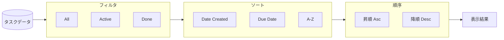

#### フィルタ機能
| フィルタ | 説明 |
|----------|------|
| All | すべてのタスクを表示 |
| Active | 未完了タスクのみ表示 |
| Done | 完了済みタスクのみ表示 |

#### ソート機能
| ソート項目 | 説明 |
|------------|------|
| Date Created | 作成日時順 |
| Due Date | 期限順（期限なしは末尾） |
| A-Z | アルファベット/五十音順 |

#### ソート順序
- 昇順（Asc）: 古い順/早い期限順/A→Z
- 降順（Desc）: 新しい順/遅い期限順/Z→A

### 2.4 表示情報

#### タスク情報
- タスク名
- 期限（YYYY/MM/DD形式）
- 登録日時（YYYY/MM/DD HH:MM形式）
- 更新日時（登録日時と異なる場合のみ表示）
- 期限超過表示（Overdue）

#### 進捗表示
- 完了タスク数 / 総タスク数
- プログレスバーによる視覚的表示

---

## 3. データ仕様

### 3.1 Todoオブジェクト構造

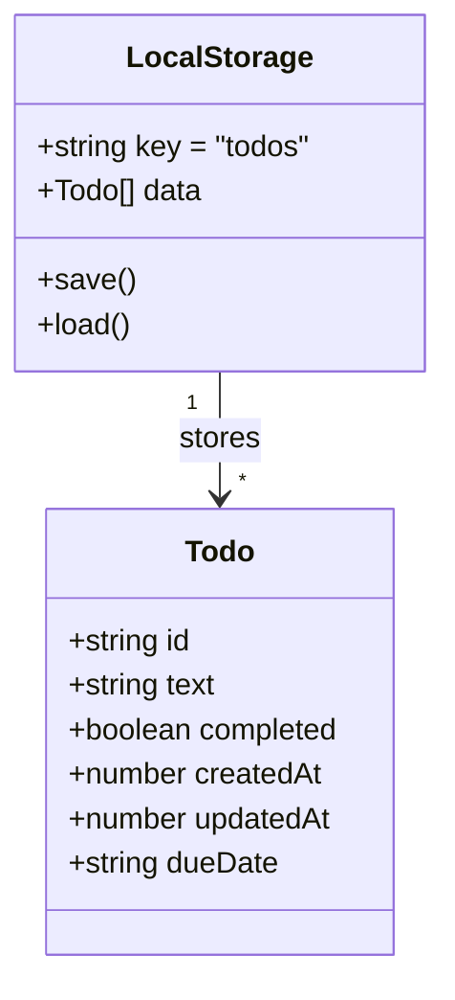

```typescript
interface Todo {
  id: string;        // 一意識別子（UUID v4）
  text: string;      // タスク名
  completed: boolean; // 完了状態
  createdAt: number;  // 作成日時（Unixタイムスタンプ）
  updatedAt: number;  // 更新日時（Unixタイムスタンプ）
  dueDate: string;    // 期限（YYYY-MM-DD形式）
}
```

### 3.2 データフロー

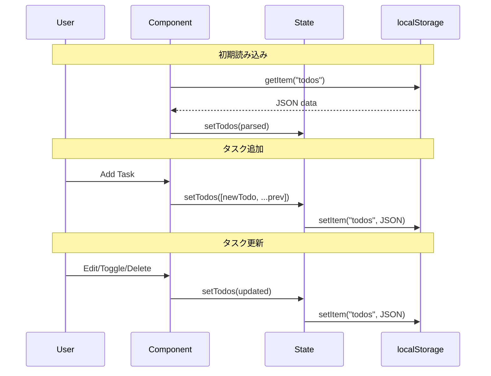

### 3.3 データ永続化
- 保存先: localStorage
- キー名: `todos`
- フォーマット: JSON配列

---

## 4. バリデーション

### 4.1 バリデーションフロー

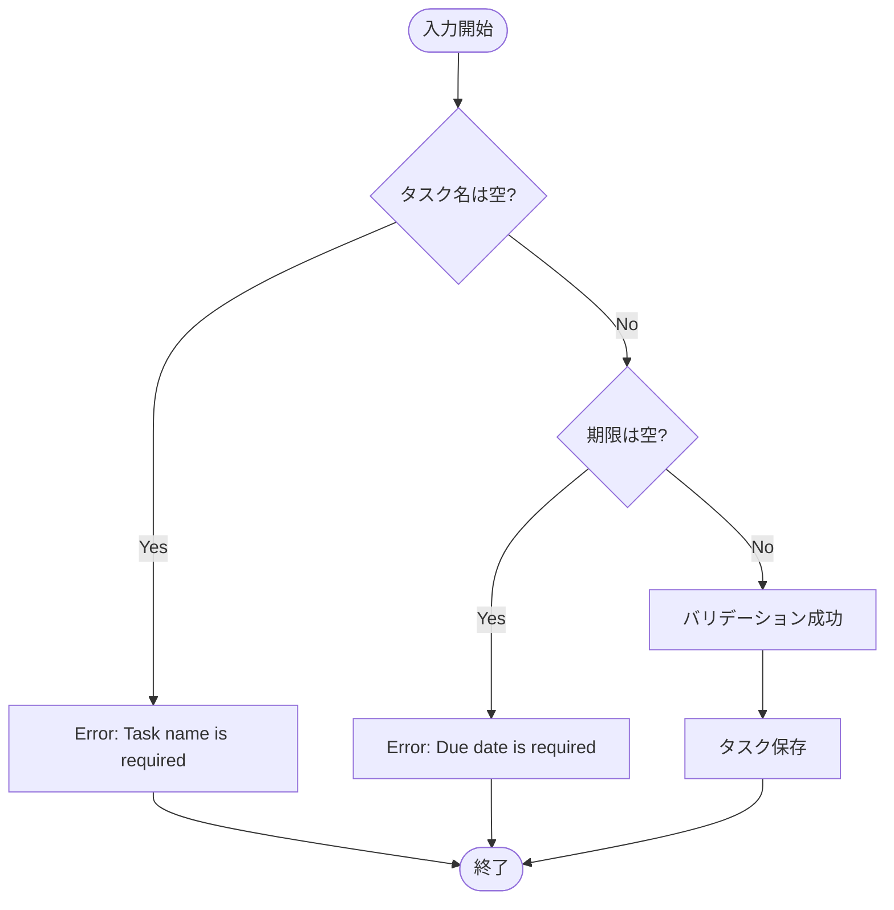

### 4.2 タスク追加時
| 項目 | ルール | エラーメッセージ |
|------|--------|------------------|
| タスク名 | 必須、空白のみ不可 | "Task name is required" |
| 期限 | 必須 | "Due date is required" |

### 4.3 タスク編集時
| 項目 | ルール | エラーメッセージ |
|------|--------|------------------|
| タスク名 | 必須、空白のみ不可 | "Task name is required" |
| 期限 | 必須 | "Due date is required" |

---

## 5. UI/UX仕様

### 5.1 画面構成

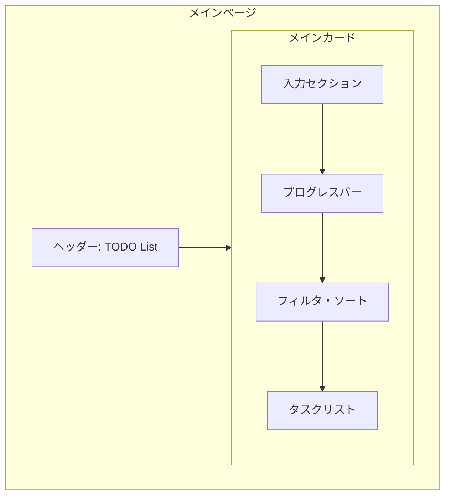

### 5.2 コンポーネント構成

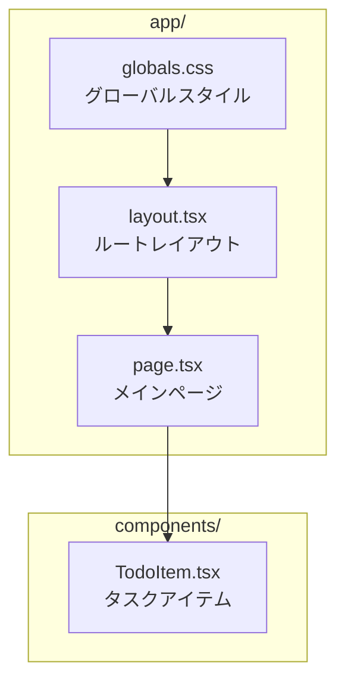

### 5.3 デザインコンセプト
- グラスモーフィズム（半透明ガラス風）デザイン
- グラデーション背景
- スムーズなアニメーション

### 5.4 カラーパレット

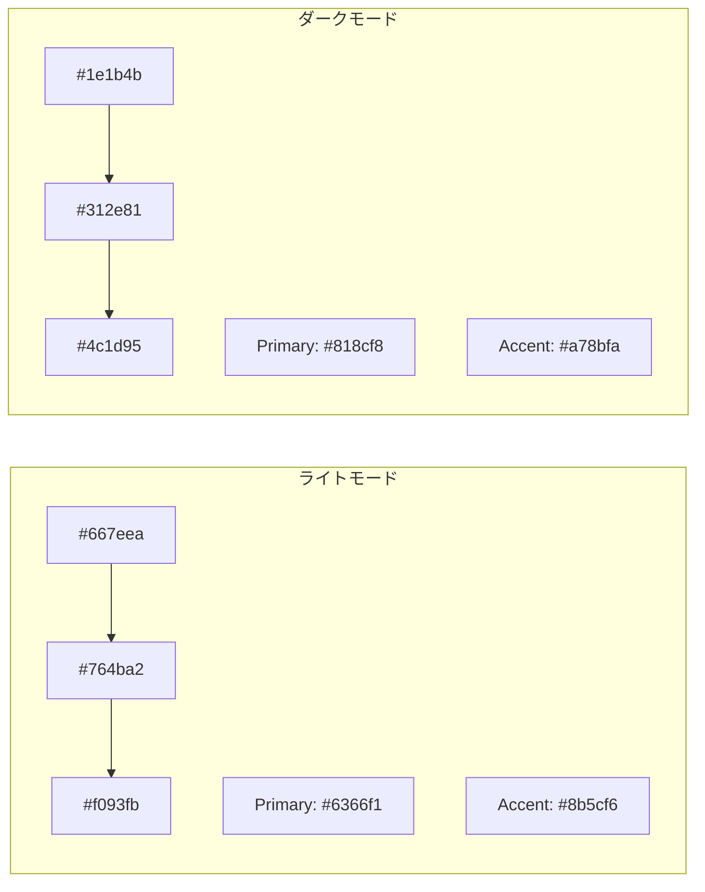

#### ライトモード
| 用途 | カラー |
|------|--------|
| 背景グラデーション | #667eea → #764ba2 → #f093fb |
| プライマリ | #6366f1 (Indigo) |
| アクセント | #8b5cf6 (Purple) |
| カード背景 | rgba(255, 255, 255, 0.8) |

#### ダークモード
| 用途 | カラー |
|------|--------|
| 背景グラデーション | #1e1b4b → #312e81 → #4c1d95 |
| プライマリ | #818cf8 |
| アクセント | #a78bfa |
| カード背景 | rgba(30, 41, 59, 0.8) |

### 5.5 アニメーション
| 要素 | アニメーション |
|------|----------------|
| ページ読み込み | フェードイン（0.3s） |
| タスク追加 | スライドイン（0.3s、ディレイ付き） |
| ボタンホバー | 浮き上がり効果 |
| タスクホバー | 右にスライド |
| チェックボックス | スケールアップ |
| プログレスバー | 幅のトランジション（0.5s） |

### 5.6 レスポンシブ対応
- 最大幅: 672px (max-w-2xl)
- モバイル対応のパディング調整
- フレックスボックスによる柔軟なレイアウト

---

## 6. 操作方法

### 6.1 ユーザーフロー

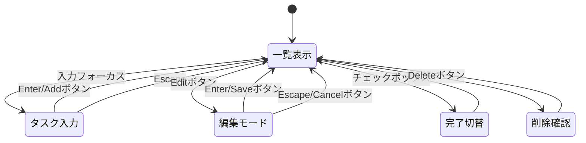

### 6.2 キーボードショートカット

#### タスク入力時
| キー | 動作 |
|------|------|
| Enter | タスクを追加 |

#### 編集モード時
| キー | 動作 |
|------|------|
| Enter | 変更を保存 |
| Escape | 編集をキャンセル |

### 6.3 マウス操作
- タスクにホバーで編集・削除ボタン表示
- チェックボックスクリックで完了切り替え

---

## 7. ファイル構成

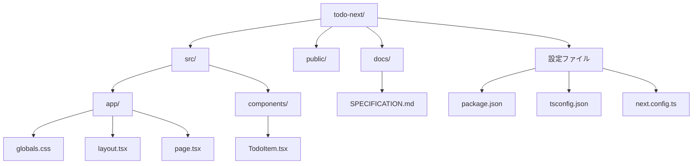

```
todo-next/
├── src/
│   ├── app/
│   │   ├── globals.css      # グローバルスタイル
│   │   ├── layout.tsx       # ルートレイアウト
│   │   └── page.tsx         # メインページ
│   └── components/
│       └── TodoItem.tsx     # タスクアイテムコンポーネント
├── public/                   # 静的ファイル
├── docs/
│   └── SPECIFICATION.md     # 本仕様書
├── package.json
├── tsconfig.json
├── next.config.ts
├── postcss.config.mjs
└── eslint.config.mjs
```

---

## 8. 動作環境

### 8.1 システム要件

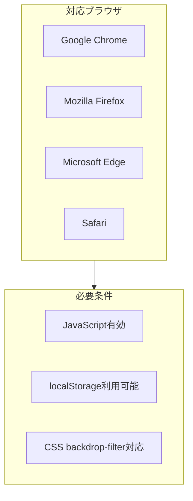

### 8.2 推奨ブラウザ
- Google Chrome（最新版）
- Mozilla Firefox（最新版）
- Microsoft Edge（最新版）
- Safari（最新版）

### 8.3 必要条件
- JavaScript有効
- localStorage利用可能
- CSS backdrop-filter対応（グラスモーフィズム表示用）

---

## 9. 起動方法

### 9.1 開発フロー

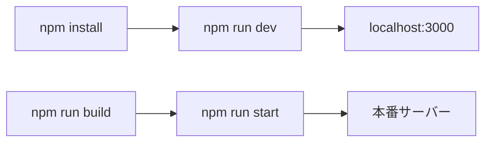

### 9.2 開発環境
```bash
npm install    # 依存関係インストール
npm run dev    # 開発サーバー起動（http://localhost:3000）
```

### 9.3 本番ビルド
```bash
npm run build  # 本番用ビルド
npm run start  # 本番サーバー起動
```

---

## 10. 今後の拡張候補

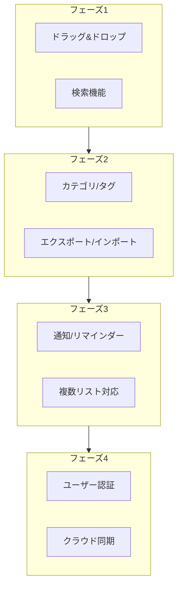

- [ ] タスクのドラッグ&ドロップ並べ替え
- [ ] カテゴリ/タグ機能
- [ ] 検索機能
- [ ] データのエクスポート/インポート
- [ ] 通知/リマインダー機能
- [ ] 複数リスト対応
- [ ] ユーザー認証とクラウド同期

---

## 11. 更新履歴

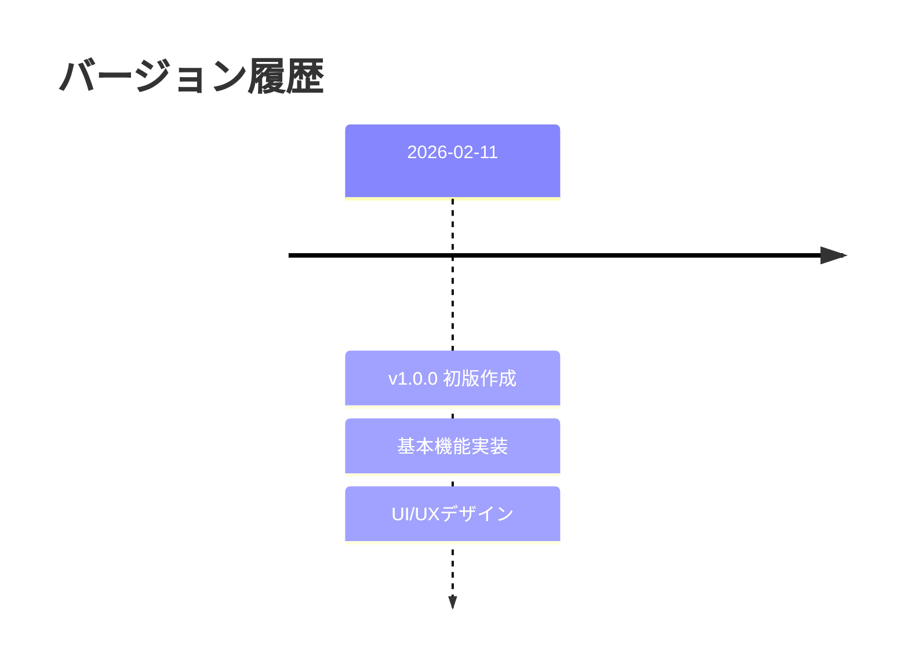

| バージョン | 日付 | 内容 |
|------------|------|------|
| 1.0.0 | 2026-02-11 | 初版作成 |

---

## 12. ライセンス

MIT License
